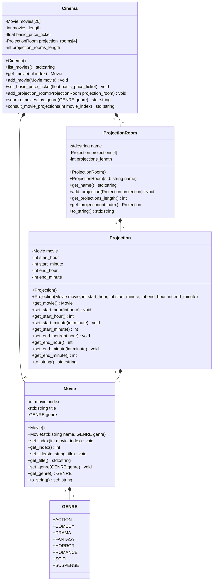

# Cinema

This program simulates a cinema management system. It allows users to manage movies, projection rooms, and projections. The main functionalities include adding movies, adding projection rooms, searching for movies by genre, consulting movie projections, and listing all movies.

## Functionalities

1. Add a movie.

   - Allows the user to add a new movie to the cinema's movie list.

   - The user needs to provide the movie's title and genre.

2. Add a projection room.

   - Allows the user to add a new projection room to the cinema.

   - The user needs to provide the name of the projection room.

   - The user can add up to $4$ projections to the projection room.

3. Search movies by genre.

   - Allows the user to search for movies by their genre.

   - The user needs to select a genre to see the list of movies in that genre.

4. Consult movie projections.

   - Allows the user to consult the projections of a specific movie.

   - The user needs to provide the movie index to see its projections.

5. List Movies.

   - Displays a list of all movies available in the cinema.

## Class Diagram

